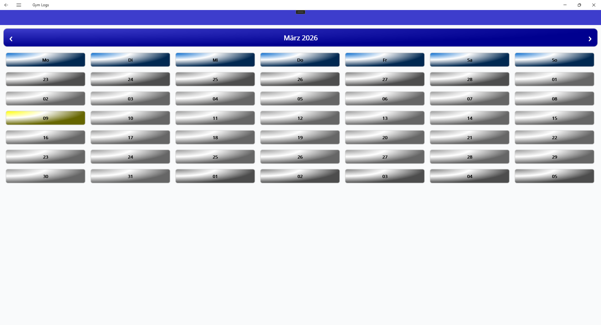
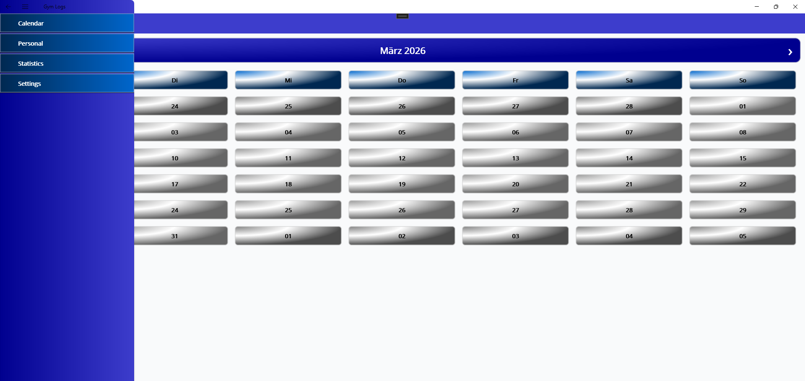
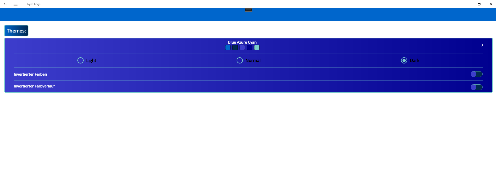
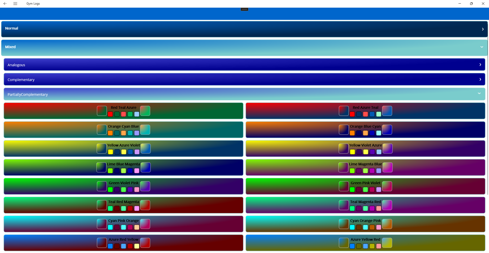

# Gym-Logs

Gym-Logs is a **Sports Tracking App** built with **.NET MAUI** that helps users log their workouts, track progress, and visualize performance over time.

⚠️ This project is currently under active development.

## Features

- Track workouts and exercises with sets, reps, and weights
- View weekly/monthly progress charts
- Manage multiple training routines
- Add notes and custom exercises
- Export workout logs for personal review

## Tech Stack 🛠️

### Languages 💻

### Frameworks & Platforms ⚙️

### Databases 📂

### Developer Tools 🧰

## Screenshots

